#  Retina Blood Vessel Segmentation using UNet
### Author: Ben Hers
### Architecture: UNet using 4 Encoder/Decoder blocks
#### Dataset: The Stare Project
Upon starting into the field of using deep learning for biomedical imaging, I started by working
on different object detection and image segmentation tasks and one of the most popular
architectures was <a href="https://arxiv.org/abs/1505.04597">UNet</a>. I happened upon the STARE project from UCSD in different biomedical image
segmentation papers on Arxiv so I decided to use this dataset as a fun/interesting dataset to try
different network architectures for image segmentation and the effect of different loss functions.
An example of the dataset is shown below. Due to the advances in fully connected layer architectures
<a href="https://arxiv.org/pdf/1512.03385.pdf">Resnet</a> has been one of the most popular network architectures for different deep learning and computer
vision tasks, so in this project I investigate using both UNet as well as for every encoder
decoder block using a residual network(RUNet). My RUNet adds in a skip connection to each
### UNet Architecture

 
<table >
    <tr>
        <th>Architecture</th>
        <th>Loss Function</th>
        <th>Learning Rate</th>
        <th>Epochs</th>
        <th>F1 Score</th>
        <th>Precision</th>
        <th>Recall</th>
    </tr>
    <tr>
        <th>UNet</th>
        <th>MSE</th>
        <th>0.001 </th>
        <th>100</th>
        <th>0.641</th>
        <th>0.909 </th>
        <th>0.54</th>
    </tr>
    <tr>
        <th>UNet</th>
        <th>MSE</th>
        <th>0.001 </th>
        <th>175</th>
        <th>0.668 </th>
        <th>0.895 </th>
        <th>0.559</th>
    </tr>
    <tr>
        <th>UNet</th>
        <th>MSE</th>
        <th>0.001 </th>
        <th>250</th>
        <th>0.767 </th>
        <th>0.847 </th>
        <th>0.724</th>
    </tr>
    <tr>
        <th>UNet</th>
        <th>MSE</th>
        <th>0.001 </th>
        <th>300</th>
        <th>0.809</th>
        <th>0.831 </th>
        <th>0.799</th>
    </tr>
    <tr>
        <th>UNet</th>
        <th>MSE</th>
        <th>0.001 </th>
        <th>350</th>
        <th>0.779</th>
        <th>0.847</th>
        <th>0.747</th>
    </tr>
    <tr>
        <th>RUNet</th>
        <th>MSE</th>
        <th>0.001</th>
        <th>100</th>
        <th>0.690</th>
        <th>0.849</th>
        <th>0.624</th>
    </tr>
    <tr>
        <th>RUNet</th>
        <th>MSE</th>
        <th>0.001</th>
        <th>175</th>
        <th>0.699</th>
        <th>0.825</th>
        <th>0.649</th>
    </tr>
    <tr>
        <th>RUNet</th>
        <th>MSE</th>
        <th>0.001</th>
        <th>250</th>
        <th>0.687</th>
        <th>0.897</th>
        <th>0.583</th>
    </tr>
    <tr>
        <th>RUNet</th>
        <th>MSE</th>
        <th>0.001</th>
        <th>300</th>
        <th>0.743</th>
        <th>0.857</th>
        <th>0.679</th>
    </tr>
    <tr>
        <th>UNet</th>
        <th>L1</th>
        <th>0.001</th>
        <th>100</th>
        <th>0.008</th>
        <th>0.978</th>
        <th>0.004</th>
    </tr>
    <tr>
        <th>UNet</th>
        <th>L1</th>
        <th>0.001 </th>
        <th>150</th>
        <th>0.016 </th>
        <th>0.638 </th>
        <th>0.008</th>
    </tr>
</table>

### Actual on left, Predicted on Right
 
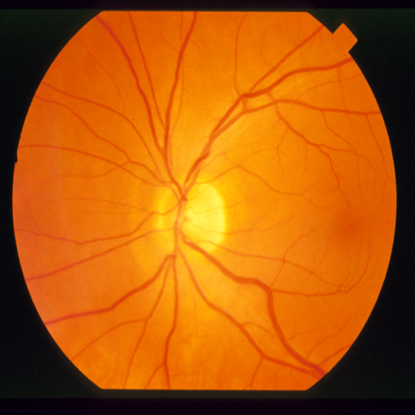
 

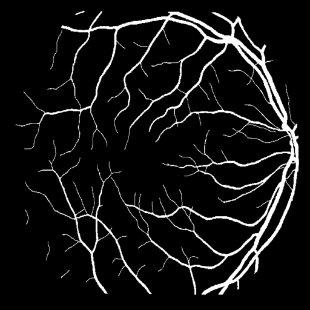
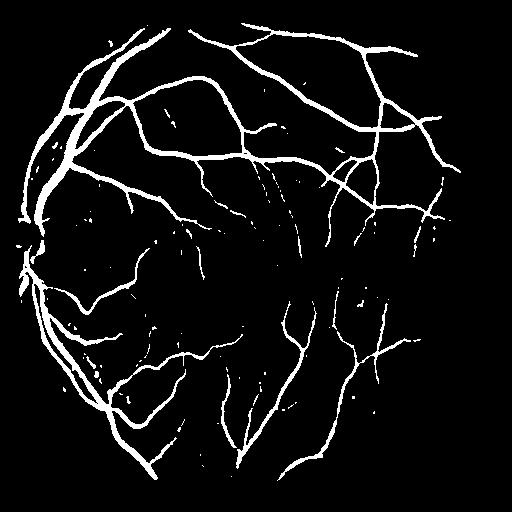

 

 

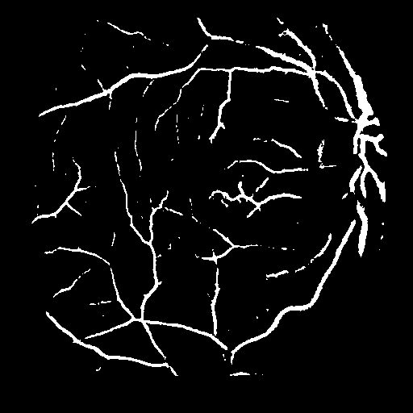

 
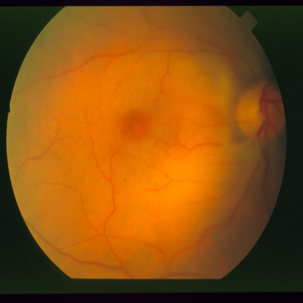
 

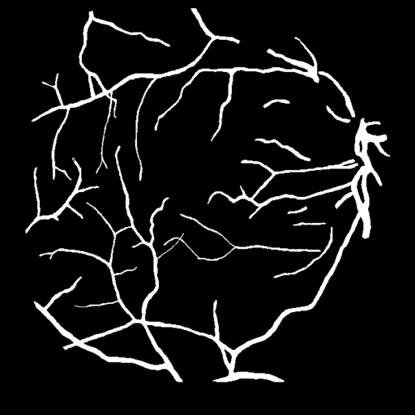
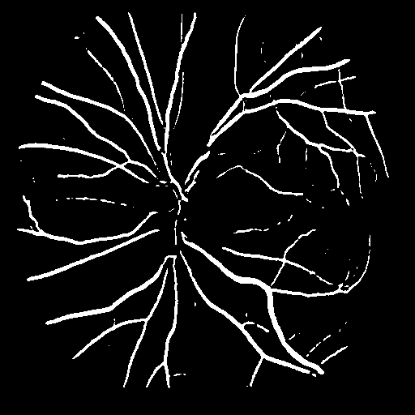

 
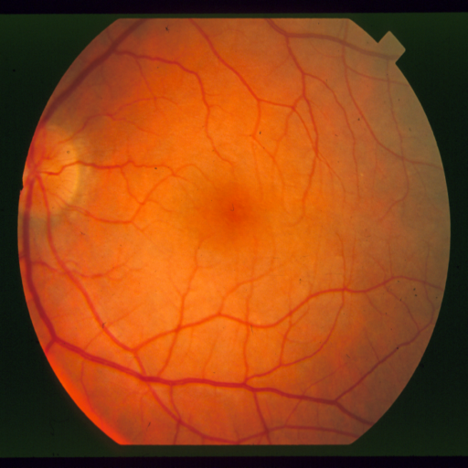
 

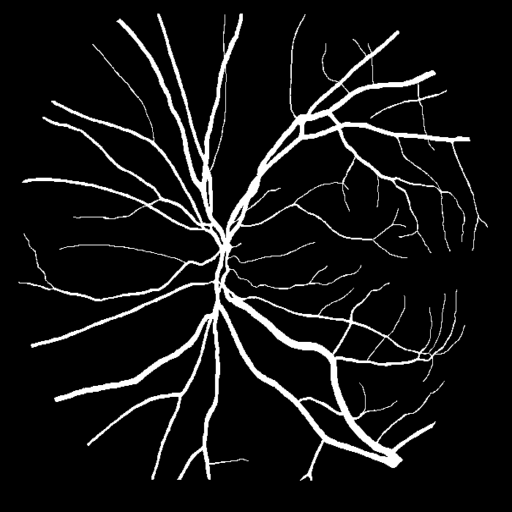
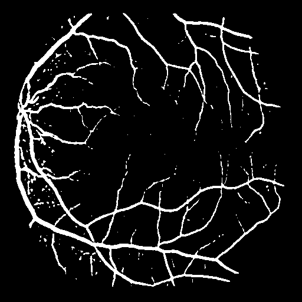

 

 

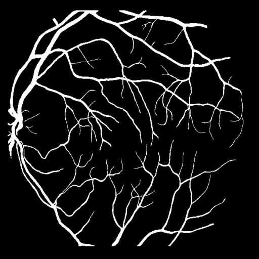
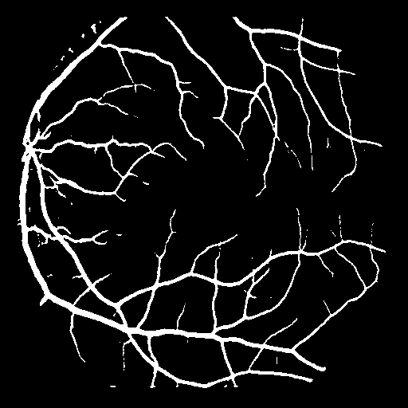

 