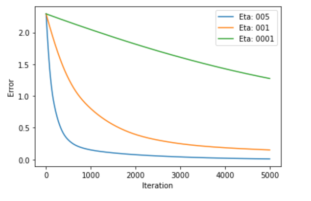

# Projects dealing with Machine Learning and Artifical Intelligence
* Logistic Regression classifier trained with gradient descent by hand using no libraries
 

* Simple 2 layer neural network from scratch no libraries

 
* Perceptron Learning Algorithm

 
<h3>Deep Learning</h3>
<ul>
    <li>CNN for MNIST10 data using PyTorch</li>
    <li> <a href="https://github.com/bhers4/Projects/tree/master/machine_learning/ImageSegmentation/RetinaBloodVessel">Retina Blood Vessel Image Segmentation </a></li>
</ul>